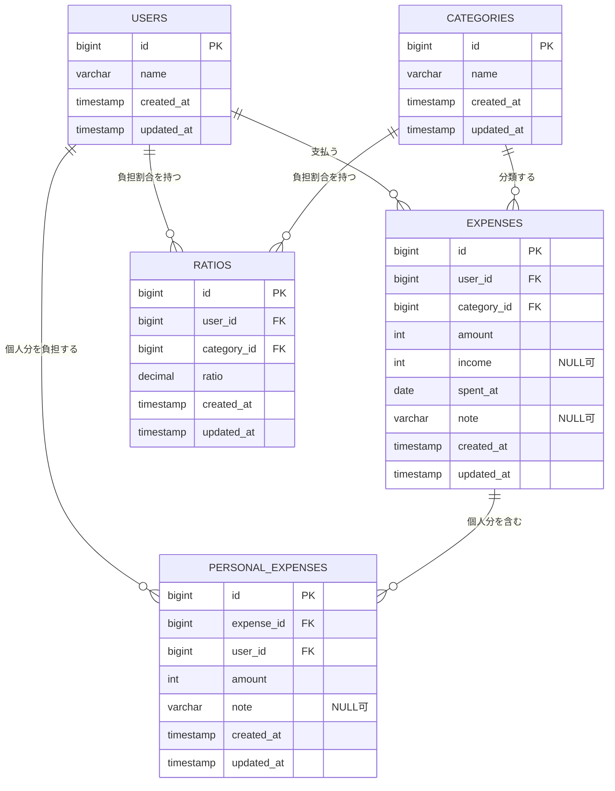

# ER図

家計簿の主要機能で使用する5テーブルの関係を表しています。



## テーブルの役割

| テーブル | 役割 |
| --- | --- |
| `users` | 支払った人、個人分を負担する人、負担割合を持つ人を管理します。 |
| `categories` | 食費や電気代など、支出の分類を管理します。 |
| `expenses` | 支出総額、売電収入、支払日、実際に支払った人を管理します。 |
| `personal_expenses` | 1件の支出に含まれる、各ユーザーが個人で負担する金額を管理します。 |
| `ratios` | ユーザーとカテゴリの組み合わせごとに、共有額の負担割合を管理します。 |

## リレーション

| 親テーブル | 子テーブル | 関係 | 外部キー |
| --- | --- | --- | --- |
| `users` | `expenses` | 1対多 | `expenses.user_id` |
| `categories` | `expenses` | 1対多 | `expenses.category_id` |
| `expenses` | `personal_expenses` | 1対多 | `personal_expenses.expense_id` |
| `users` | `personal_expenses` | 1対多 | `personal_expenses.user_id` |
| `users` | `ratios` | 1対多 | `ratios.user_id` |
| `categories` | `ratios` | 1対多 | `ratios.category_id` |

## 金額計算での役割

```text
差引額 = expenses.amount - expenses.income
共有額 = 差引額 - personal_expenses.amount の合計
各ユーザーの負担額 = 共有額 × ratios.ratio + そのユーザーの個人分
```

`ratios.ratio` は、50%の場合に `0.50` として保存されます。

## 補足

- ER 図では家計簿の主要機能に関係するテーブルだけを掲載しています。
- Laravel が提供する `password_reset_tokens`、`failed_jobs`、`personal_access_tokens` は省略しています。
- マイグレーションでは `foreignId` が使われていますが、外部キー制約の `constrained()` は設定されていません。
